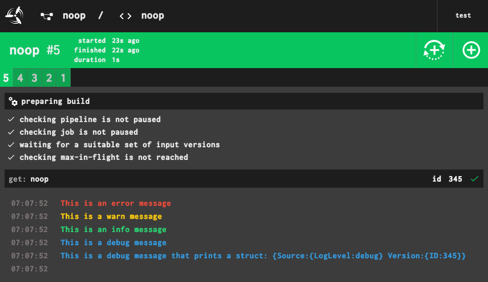

# intercom

A small logging package for use in Golang-based [Concourse resource type implementations](https://concourse-ci.org/implementing-resource-types.html)

Because Concourse resources communicate with Concourse over stdout, it's [recommended](https://concourse-ci.org/implementing-resource-types.html) that:

> Resources can emit logs to the user by writing to stderr. ANSI escape codes (coloring, cursor movement, etc.) will be interpreted properly by the web UI, so you should make your output pretty.

`intercom` does just this and writes to stderr:



## Usage Example

```golang
logger := intercom.NewLogger("debug")

// prints red text
logger.Errorf("foo")

// prints yellow text
logger.Warnf("bar")

// prints green text
logger.Infof("baz")

// prints blue text
logger.Debugf("bim")
```

All methods ultimately use `Fprintf`, so you can also do things like...

```golang
// prints 'foo bar' in red text
logger.Errorf("foo %s", "bar")
```

## Exposing log level configuration to users

By using `intercom` as a configurable logger, Concourse [resource authors](https://concourse-ci.org/implementing-resource-types.html) can expose log level configuration to users, enabling end users better troubleshooting capabilities via a configurable `source` field:

```yaml
resource_types:

- name: some-resource
  type: docker-image
  source:
    repository: owner/some-resource

resources:

- name: some-resource
  type: some-resource
  source:
    log_level: debug
```
